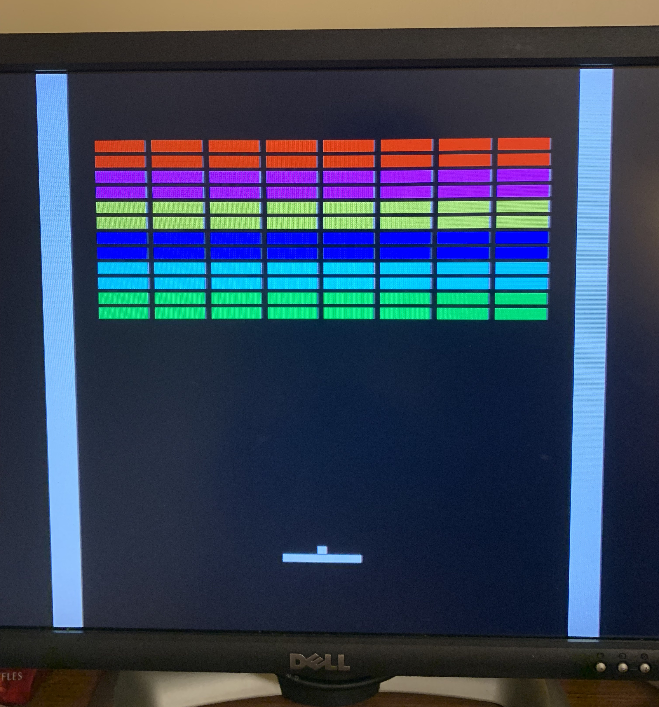

# Tiva VGA Breakout #

This repository contains a simplified game of breakout written for the [TI Tiva-C EK-TM4C123GXL](http://www.ti.com/tool/EK-TM4C123GXL). It was written in a
weekend while waiting for the first lab of UB's CSE 379 (Intro to Microprocessors) to be posted.

Graphics are done over VGA (!) at a resolution of 800x600@60Hz (SVGA), with duplicated horizontal pixels for an effective
resolution of 200x600. This is done via a combination of timer peripherals in PWM mode to generate the timing signals
(HSYNC and VSYNC), and SPI peripherals (1 per color channel) to generate 3-bit color. DMA is used to feed each color
channel (each staggered by 4 bit periods to avoid contention for memory access) from a RAM linebuffer. The linebuffer is
refilled between each scanline by the HBLANK ISR. A VBLANK ISR handles the game logic.

## Pin Assignments ##

Pin          | Assignment
-------------|-----------
VGA VSYNC    | PC4
VGA HSYNC    | PB6
VGA RED      | PA5
VGA GREEN    | PD3
VGA BLUE     | PB7
Paddle LEFT  | PF4 (SW1)
Paddle RIGHT | PF0 (SW2)

## Screenshot ##

